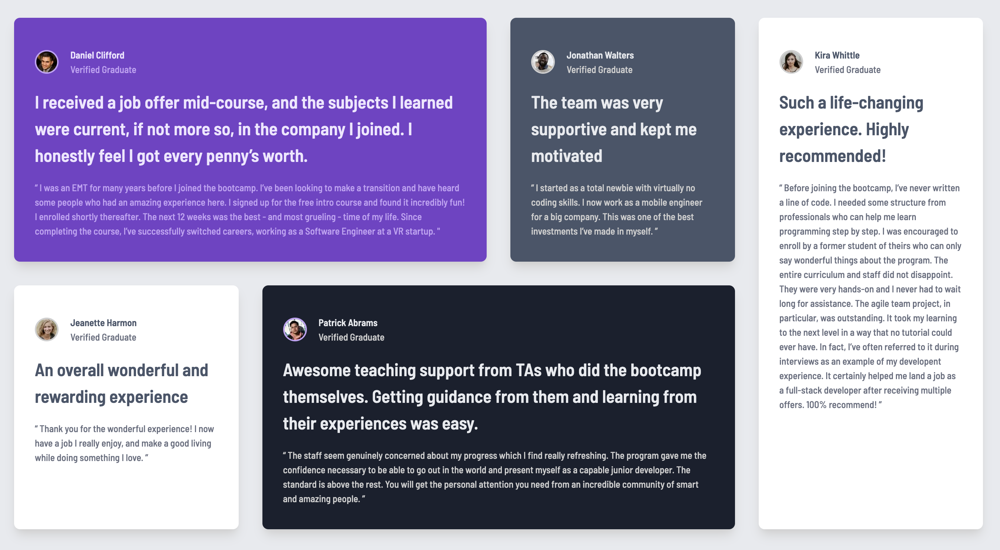

# Frontend Mentor - Testimonials grid section solution

This is a solution to the [Testimonials grid section challenge on Frontend Mentor](https://www.frontendmentor.io/challenges/testimonials-grid-section-Nnw6J7Un7). Frontend Mentor challenges help you improve your coding skills by building realistic projects.

## Table of contents

- [Overview](#overview)
  - [The challenge](#the-challenge)
  - [Screenshot](#screenshot)
  - [Links](#links)
- [My process](#my-process)
  - [Built with](#built-with)
  - [What I learned](#what-i-learned)
  - [Continued development](#continued-development)
  - [Useful resources](#useful-resources)
- [Author](#author)
- [Acknowledgments](#acknowledgments)

**Note: Delete this note and update the table of contents based on what sections you keep.**

## Overview

### The challenge

Users should be able to:

- View the optimal layout for the site depending on their device's screen size

### Screenshot

### Links

- Solution URL: [Github](https://github.com/tmykkanen/fm-testimonials-grid-secion-main)
- Live Site URL: [Netlify](https://tlmfmtestimonialsgridsection.netlify.app)

## My process

### Built with

- 
- 
- 

### What I learned

- I implemented google font using `@import url`
- I focused on trying to use as much vanilla css as possible. I still used tailwind for general reset and a few utility classes.
- I tried `<header>` as a semantic html tag (rather than just the wrapper for a header nav).
- I continued to improve my understanding of CSS Grid and @container queries.

### Continued development

- I'd like to continue to use flex / grid better.
- I'd like to make my CSS as clean as possible.

### Useful resources

- In my googling, I came across these helpful articles. Didn't use them much in this particular project, but I'm saving here for future reference.

- [CSS tricks on accessibility](https://css-tricks.com/small-tweaks-can-make-huge-impact-websites-accessibility/)
- [On css variables](https://alexvipond.dev/blog/im-finally-using-css-variables)

## Author

- Website - [Github](https://github.com/tmykkanen)
- Frontend Mentor - [@tmykkanen](https://www.frontendmentor.io/profile/tmykkanen)
